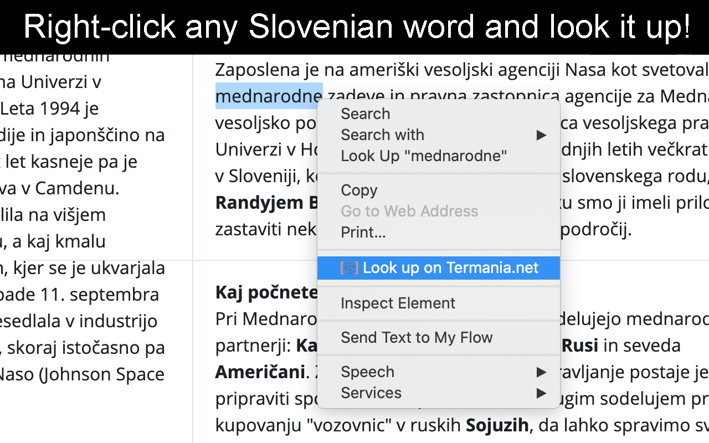
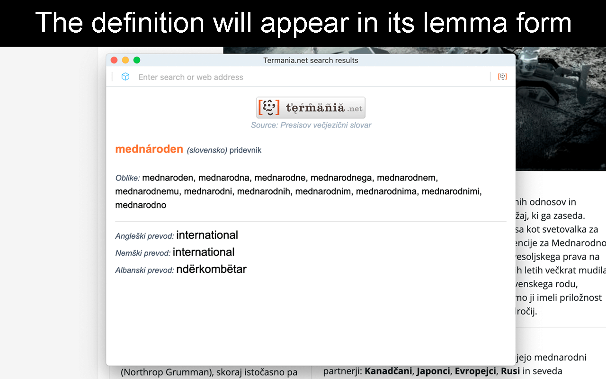
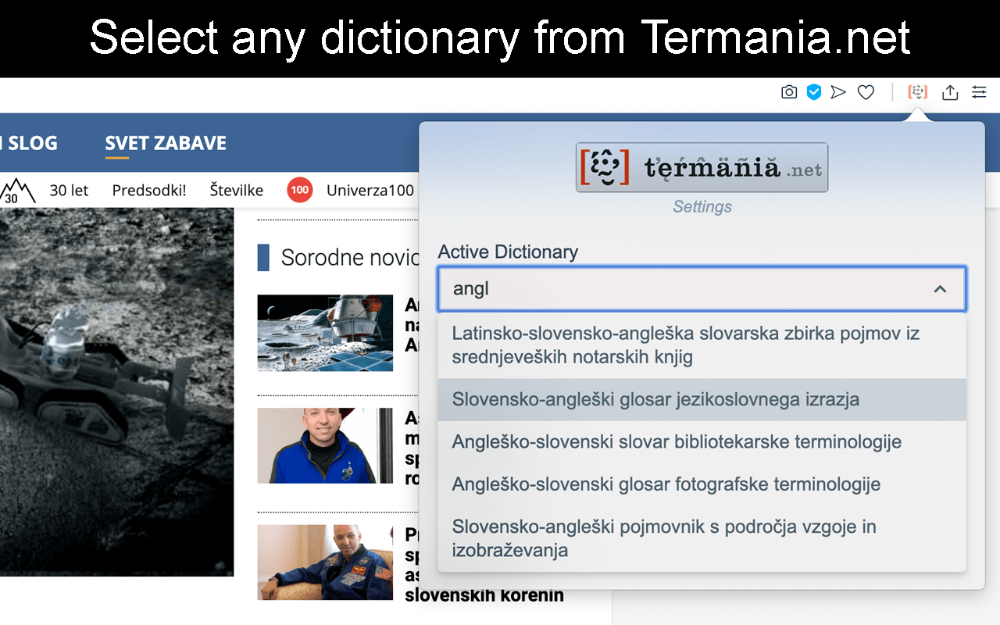
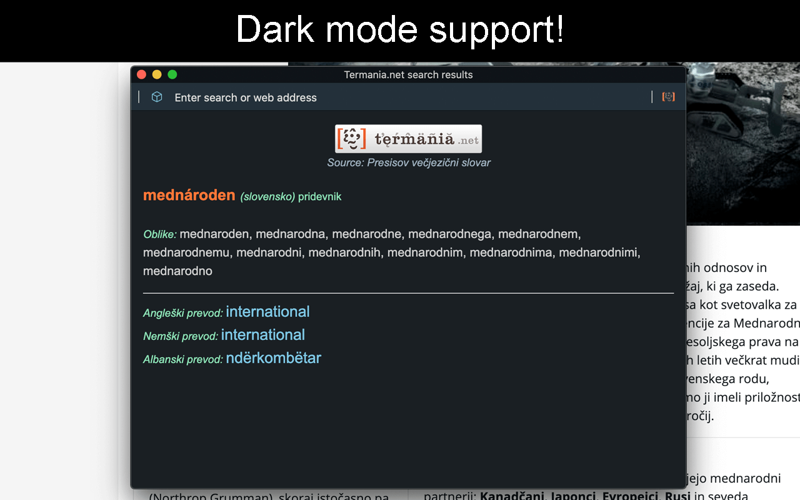
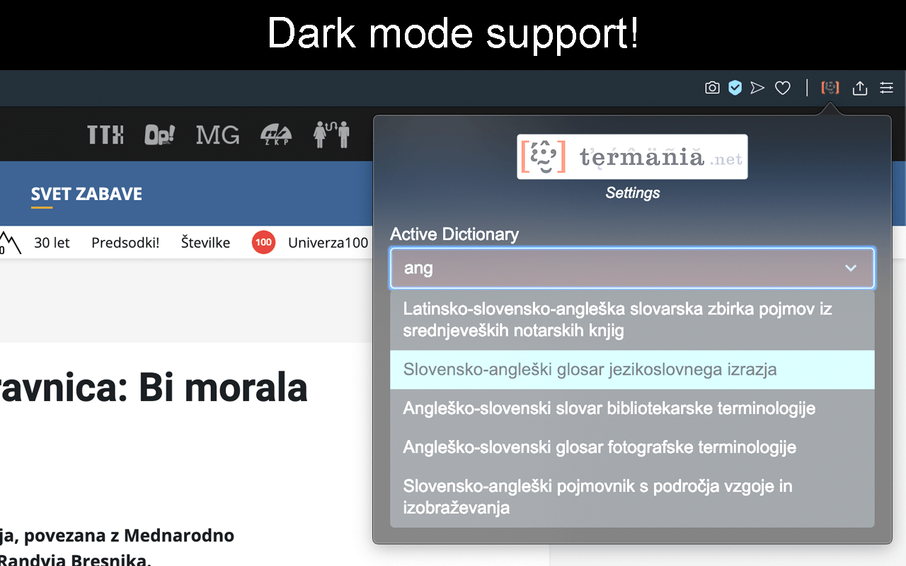

<div align="center">
    <a href="https://www.termania.net" target="_blank">
        
    </a>
</div>

# Termania.net Lookup Opera Extension

[](https://github.com/techouse/termania-opera-extension/blob/master/LICENSE)
[](https://www.codacy.com/manual/techouse/termania-opera-extension?utm_source=github.com&amp;utm_medium=referral&amp;utm_content=techouse/termania-opera-extension&amp;utm_campaign=Badge_Grade)


This Opera extension enables foreigners as well as Slovenian native speakers to search the extensive Slovenian
dictionary search engine [Termania.net][0] with the click of a single button.

## Why yet another Opera Extension
I wanted to build something that actually solves a problem and helps people, especially foreigners
who are trying to learn the Slovenian language.

## How do I install it? :rocket:
TBA ...

## Is there a Chrome version? :crystal_ball:
Yes and it can be accessed [here][2].

## Is there a Firefox version? :fox_face:
Yes and it can be accessed [here][3].

## How does it work?
The user first needs to select a Slovenian word and right-click it to open Opera's context menu:



In order to query only the [lemmas][1] of each word form the extension makes use of the
[Morphological lexicon Sloleks 2.0](http://eng.slovenscina.eu/sloleks/opis) indexed in an IndexedDB database
which holds over 100.000 lemmas.
In order to get the [1.5 GB lexicon from XML](https://www.clarin.si/repository/xmlui/handle/11356/1230) to SQLite and
then finally into IndexedDB I wrote [parser](https://github.com/techouse/sloleks-parser) in Python.

Once the correct lemma is identified an API call gets sent to [Termania.net][0]
which in turn supplies all the information that is then presented to the user in a popup window.



You also have the option to change the default dictionary to any dictionary provided by [Termania.net][0]! All you have
to do is open the popup menu in Opera's Menu bar and make your choice!



## Why is the installation of the extension taking so long?
Unfortunately the Sloleks database housing all those 100.000 lemmas is quite large (approx. 50MB)
and importing it into IndexedDB takes about 5 minutes to complete during which time you wou't be
able to use the extension.

The extension also supports dark mode :sunglasses:





## How do I build it from source?
The extension uses a lot of different JavaScript libraries and has to be compiled with [npm](https://nodejs.org/en/)
and [Webpack](https://webpack.js.org). Ensure you have `Node.js` and `npm` installed and run these commands:

```bash
npm install
npm run build
```

The finished extension will present itself in a directory called `build`. From there you can
[load it as an unpacked extension](https://dev.opera.com/extensions/basics/#step-4-testing-your-extension).

[0]: https://www.termania.net
[1]: https://en.wikipedia.org/wiki/Lemma_(morphology)
[2]: https://chrome.google.com/webstore/detail/termanianet-lookup/glpefieanjalchgipjpafmhljaedgndf
[3]: https://addons.mozilla.org/en-US/firefox/addon/termania-net-lookup/
